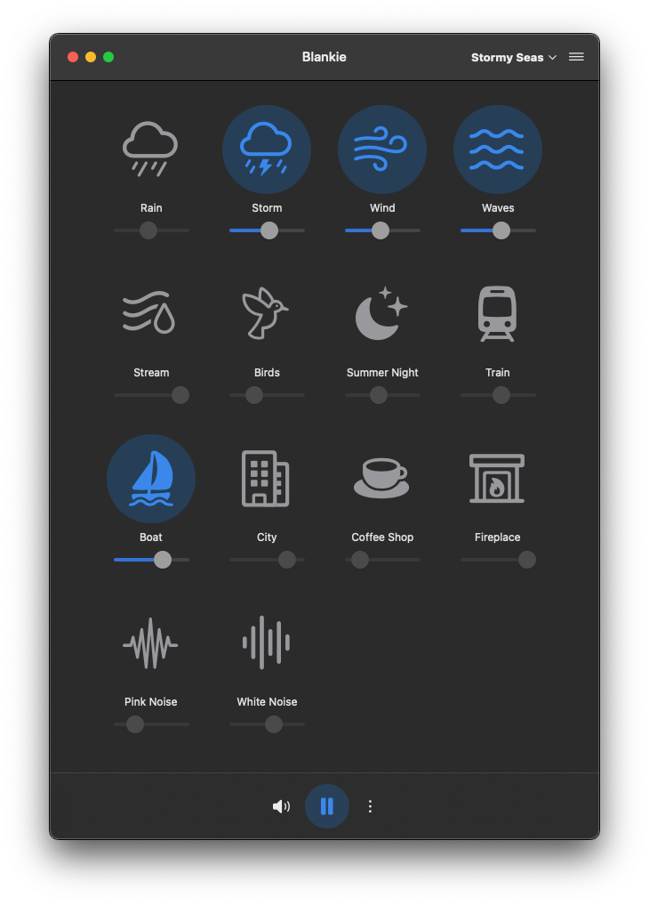

### Blankie

<small>Ambient sound mixer inspired by <a href="https://github.com/rafaelmardojai/blanket">Blanket</a></small>

[](https://www.apple.com/macos/)
[](https://swift.org)
[](https://developer.apple.com/xcode/swiftui/)
[](https://developer.apple.com/xcode/)
[](https://github.com/codybrom/blankie/blob/master/LICENSE)


## Description

Blankie makes it easy to mix different ambient sounds into a custom soundscape. Use it to focus and increase your productivity or help you fall asleep in a noisy environment. Blankie is a native macOS app with support for automatic light/dark modes, and your system or a custom accent color and global play/pause control from your keyboard's media keys, command center, or headphones.

## Features

- 14 high-quality ambient sounds:
  - Nature sounds (rain, waves, birds, wind)
  - Environmental sounds (train, city, coffee shop)
  - White/pink noise
- Individual volume controls for each sound
- Global volume control
- Preset system to save your favorite sound combinations
- Native macOS integration
  - System media controls
  - Automatic or customizable light/dark modes
  - Automatic or custom accent colors

## Requirements to Run

macOS Ventura 13.5 or later

## Development Setup

1. Clone the repository
2. Copy `Configuration.example.xcconfig` to `Configuration.xcconfig`
3. Edit `Configuration.xcconfig` to set your development team and bundle identifier:

   ```xcconfig
   DEVELOPMENT_TEAM = YOUR_TEAM_ID_HERE
   PRODUCT_BUNDLE_IDENTIFIER = com.your.identifier
   ```

4. Open `Blankie.xcodeproj` in Xcode
5. Build and run!

Note: `Configuration.xcconfig` is ignored by git to keep your personal development settings private.

## Sound Credits

All sounds are used under various open licenses. Full attribution information about sounds licensing is visible in the About screen in the app.

## Credits

An incredibly special thanks to [Rafael Mardojai CM](https://github.com/rafaelmardojai) and all the contributors to the [Blanket](https://github.com/rafaelmardojai/blanket) project which inspired me to build this app when I couldn't find a free, simple and open-source Mac app like it.

## Contributing

Contributions are welcome! Please feel free to submit a Pull Request. Here are some areas that still need work to bring it to parity with Blanket:

- [Add custom sound support](https://github.com/codybrom/blankie/issues/1)
- [Internationalization / Translation](https://github.com/codybrom/blankie/issues/2)

## License

This project is licensed under the MIT License - see the [LICENSE](LICENSE) file for details.

## Support

If you encounter any issues or have feature requests, please file them in the [GitHub Issues](https://github.com/codybrom/blankie/issues) section.

---

Note: Blankie is an independent project built for macOS. Blankie and its developer did not use any of the original code from the Blanket project. Blankie is not affiliated with or endorsed by the Blanket project.
