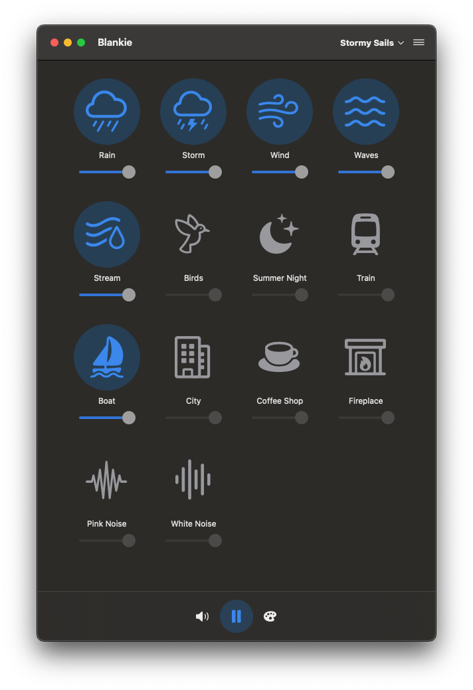

### Blankie

<small>Ambient sound mixer for macOS inspired by <a href="https://github.com/rafaelmardojai/blanket">Blanket</a></small>

[](https://www.apple.com/macos/)
[](https://swift.org)
[](https://developer.apple.com/xcode/swiftui/)
[](https://developer.apple.com/xcode/)
[](https://github.com/codybrom/blankie/blob/master/LICENSE)

<div align="center">
  <a href="https://apps.apple.com/us/app/blankie/id6740096581">
    <p></p>
    <p></p>
  </a>
</div>

## Installation Options

### Mac App Store (Recommended)

The recommended installation method is through the [Mac App Store](https://apps.apple.com/us/app/blankie/id6740096581), which provides automatic updates.

### Direct Download

You can download the Apple-notarized binary directly from [GitHub Releases](https://github.com/codybrom/blankie/releases/latest/download/Blankie.zip).

### Homebrew

You can also install Blankie using Homebrew:

```bash
brew install --cask blankie
```

Visit the [Blankie cask page on brew.sh](https://formulae.brew.sh/cask/blankie) for more information.

### iOS, iPadOS, and visionOS Beta

Blankie is coming to iOS, iPadOS, and visionOS! Join the TestFlight beta to help test:
[Join Blankie TestFlight Beta](https://testflight.apple.com/join/XgpBpWv8)

## Description

Blankie makes it easy to mix different ambient sounds into a custom soundscape. Use it to focus and increase your productivity or help you fall asleep in a noisy environment. Blankie is a native macOS app with support for automatic light/dark modes, and your system or a custom accent color and global play/pause control from your keyboard's media keys, command center, or headphones.

## Features

- 14 high-quality ambient sounds:
  - Nature sounds (rain, waves, birds, wind)
  - Environmental sounds (train, city, coffee shop)
  - White/pink noise
- Individual volume controls for each sound
- Global volume control
- Preset system to save your favorite sound combinations
- Native macOS integration:
  - System media controls
  - Automatic or customizable light/dark modes
  - Automatic or custom accent colors

## Supported Languages

Blankie automatically uses your system language when available. It currently supports more than 7 languages, including:

- English, US [default]
- English, Great Britain
- Español (Spanish)
- Deutsch (German)
- Français (French)
- Italiano (Italian)
- Türkçe (Turkish)
- 中文 (Chinese, Simplified)

### Translation Credits

| Language | Translators |
|----------|------------|
| Español | Chuskas |
| Türkçe | aybarsnazlica |
| Italiano | davnr |
| Deutsch | *Contributions welcome!* |
| Français | *Contributions welcome!* |
| 中文（简体) | *Contributions welcome!* |
| *Other Languages* | Contributions welcome! |

## Contributing

We welcome contributions from the community! There are many ways to contribute to Blankie:

- **Code**: Help fix bugs, add features, or improve performance
- **Localization**: Help translate Blankie into your language
- **Testing**: Try new features and report issues
- **Documentation**: Improve our docs and website
- **Ideas**: Submit feature requests and provide feedback

Before contributing, please review our [Contributing Guidelines](CONTRIBUTING.md) and [Code of Conduct](CODE_OF_CONDUCT.md).

### Current Priority Areas for Contribution

We're currenly looking for help with:

- [Adding custom sound support](https://github.com/codybrom/blankie/issues/1)
- [Translating Blankie into other languages](https://github.com/codybrom/blankie/blob/main/CONTRIBUTING.md#translation-contributions)

## Development Setup

1. **Fork the repository and clone it to your local machine.**

2. **Copy `Configuration.example.xcconfig` to `Configuration.xcconfig`.**
    - Configuration.xcconfig is ignored by git to keep Bundle IDs and Team IDs private. Do not commit this file publicly to protect your work from impersonation, account misuse, and distribution conflicts.

3. **Add your development team to `Configuration.xcconfig`.**

      ```plaintext
      DEVELOPMENT_TEAM = YOUR_TEAM_ID_HERE
      ```

    - **Apple Developer Program Members:**
        - Retrieve your **Team ID**:
            1. Open Xcode and go to **Xcode > Preferences > Accounts**.
            2. Sign in with your Apple ID if you haven’t already.
            3. Select your account, click **Manage Certificates** or **View Details**, and find your **Team ID** under your account name.
        - Add your Team ID to `Configuration.xcconfig`:

    - **If You Are Not a Member of the Apple Developer Program:**
        - You can still test the app on your devices for free by creating an Xcode **Personal Team**. Follow these steps:
            1. Open Xcode and go to **Xcode > Preferences > Accounts**.
            2. Click the "+" button to add your Apple ID (if not already added).
            3. After signing in, Xcode will automatically create a **Personal Team** associated with your Apple ID.
            4. Go to **Xcode > Preferences > Accounts**, select your account, and click **View Details**. The Team ID for your Personal Team will be listed.
        - Use the Team ID from your Personal Team in `Configuration.xcconfig`:

4. **Set the Bundle Identifier:**

      ```plaintext
      PRODUCT_BUNDLE_IDENTIFIER = com.yournamehere.blankie
      ```

    - In `Configuration.xcconfig`, set `PRODUCT_BUNDLE_IDENTIFIER` to a unique identifier. You can use any reverse domain name format for the bundle identifier, but it must be unique. You **cannot** use the same bundle identifier as the main Blankie app.

5. **Open `Blankie.xcodeproj` in Xcode**

6. **Build and run the project!**

## Documentation

Additional information about Blankie, including an FAQ and more credits, are available on the [Blankie website](https://blankie.rest). The website is created using Astro and hosted on GitHub Pages. The source code is available in the `docs` directory.

Information about the Blankie website's source code can be found in its [README](docs/README.md) file.

## Credits

### Special Thanks

An incredibly special thanks to [Rafael Mardojai CM](https://github.com/rafaelmardojai) and all the contributors to the [Blanket](https://github.com/rafaelmardojai/blanket) project which inspired me to build this app when I couldn't find a free, simple and open-source Mac app like it.

### Sounds

The sounds in Blankie are used under various open licenses. Full attribution information about sounds and licensing is available on the Blankie website at [blankie.rest/credits](https://blankie.rest/credits) or on the About screen of the app.

### App Logo / Icon

The Blankie logo and app icon were created by [Cody Bromley](https://github.com/codybrom) and are licensed under a <a href="https://creativecommons.org/licenses/by/4.0/?ref=chooser-v1" target="_blank" rel="license noopener noreferrer">Creative Commons Attribution 4.0 International license </a>

You may share, copy, and adapt the Blankie logo/icon, but you must give appropriate credit, link to the license, and indicate if changes were made.

Press and media may use the Blankie app icon and logo without modification to reference the Blankie app, provided proper attribution is given.

### Sound Icons

Blankie uses [SF Symbols](https://developer.apple.com/sf-symbols/) for sound icons. SF Symbols are provided by Apple as a system resource, with usage governed by the [Xcode and Apple SDKs Agreement](https://www.apple.com/legal/sla/docs/xcode.pdf). They are not stored in this repository and are not covered by Blankie's license.

## License & Copyright

© 2025 Cody Bromley and contributors. All rights reserved.

The Blankie name and trademark rights are reserved. The Blankie logo and app icon are licensed under a [Creative Commons Attribution 4.0 International License](https://creativecommons.org/licenses/by/4.0/).

The Blankie source code and website code are copyright Cody Bromley and licensed under the MIT License. Please read Blankie's [LICENSE](LICENSE) for full details. Contributions to Blankie are welcome and will be released under the same license.

Different components of Blankie (such as sounds, icons, or others) may be covered by different licenses. Full attribution information about sounds and licensing for included items is available on the Blankie website at [blankie.rest/credits](https://blankie.rest/credits) and on the About screen of the app.

## Support & Community

- 🐛 Find a bug? [Open an issue](https://github.com/codybrom/blankie/issues/new?assignees=&labels=bug&projects=&template=bug_report.md&title=BUG%3A+)
- 💡 Have an idea? [Submit a feature request](https://github.com/codybrom/blankie/issues/new?assignees=&labels=enhancement&projects=&template=feature_request.md&title=IDEA%3A+)
- 💬 Join the discussion in our [GitHub Discussions](https://github.com/codybrom/blankie/discussions)

---

> Blankie is an independent macOS application inspired by Blanket. Blankie was built without re-using any code from the Blanket project, though it does use some of the same openly licensed sound files. Blankie is not affiliated with or endorsed by the Blanket team or any of its contributors.
