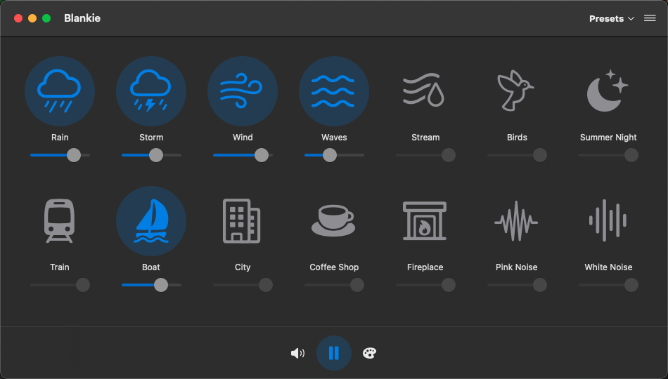

<div align="center">
  
  
# Blankie

  Ambient sound mixer for macOS
  
  <p align="center">
    
    
    
    <a href="https://github.com/codybrom/blankie/blob/master/LICENSE"></a>
    <a href="https://formulae.brew.sh/cask/blankie"></a>
  </p>
  <p align="center">
    <a href="https://apps.apple.com/us/app/blankie/id6740096581"></a>
  </p>
  <p align="center">
    
  </p>
</div>

## Quick Links

- 📖 [FAQ](FAQ.md)
- 🤝 [Contributing](CONTRIBUTING.md)
- 💻 [Development Setup](DEVELOPMENT.md)
- 🚀 [Release Process](notes/RELEASE.md.md)
- 📋 [Changelog](CHANGELOG.md)
- 🌐 [Website](https://blankie.rest)

## About

Blankie helps you focus, relax, and sleep better by creating perfect ambient soundscapes. Mix and match 14 high-quality sounds to create your ideal environment for work, study, or rest.

**Why choose Blankie?**

- 🎯 Focus deeply without distractions
- 😴 Sleep better by masking disruptive sounds
- 🧘 Stay calm with soothing soundscapes
- 🎨 Create custom ambient environments

## Features

- **14 high-quality ambient sounds** including rain, waves, fireplace, and more
- **Mix multiple sounds** with individual volume controls
- **Save custom presets** for quick access to your favorite combinations
- **Native macOS app** with automatic light/dark mode support
- **System integration** with media keys and Control Center
- **7+ languages supported** with more coming soon

## Installation

### Mac App Store (Recommended)

<a href="https://apps.apple.com/us/app/blankie/id6740096581"></a>

Get automatic updates through the Mac App Store.

### Homebrew

```bash
brew install --cask blankie
```

### Direct Download

Download the latest notarized release from [GitHub Releases](https://github.com/codybrom/blankie/releases/latest).

### Beta Testing

Join our [TestFlight beta](https://testflight.apple.com/join/XgpBpWv8) to test new features and upcoming iOS/iPadOS versions.

## Development

Want to contribute code? Check out our **[Development Setup Guide](DEVELOPMENT.md)** to get started with:

- Setting up Xcode and your development environment
- Configuring your bundle ID and team
- Building and running the project
- Code style guidelines

## Contributing

We'd love your help making Blankie even better!

- ⭐ Star this repo
- 🐛 [Report bugs](https://github.com/codybrom/blankie/issues/new?assignees=&labels=bug&projects=&template=bug_report.yml&title=%5BBug%5D%3A+)
- 💡 [Request features](https://github.com/codybrom/blankie/issues/new?assignees=&labels=enhancement&projects=&template=feature_request.yml&title=%5BFeature%5D%3A+)
- 🌍 [Help translate](CONTRIBUTING.md#translation-contributions)
- 💻 [Contribute code](CONTRIBUTING.md#code-contributions)

See our [Contributing Guidelines](CONTRIBUTING.md) and [Code of Conduct](CODE_OF_CONDUCT.md) for details.

## License

© 2025 Cody Bromley and contributors. All rights reserved.

- **Source code**: [MIT License](LICENSE)
- **Logo/Icon**: [CC BY 4.0](https://creativecommons.org/licenses/by/4.0/)
- **Sounds**: Various open licenses (see [credits](https://blankie.rest/credits))

## Support

Blankie is free and open-source. Support development via:

- [GitHub Sponsors](https://github.com/sponsors/codybrom)
- [Ko-fi](https://ko-fi.com/codybrom)
- [Buy Me a Coffee](https://buymeacoffee.com/codybrom)

---

<div align="center">
  <sub>
    Inspired by <a href="https://github.com/rafaelmardojai/blanket">Blanket</a> • Built with ❤️ by <a href="https://github.com/codybrom">Cody Bromley</a> and contributors
  </sub>
</div>
